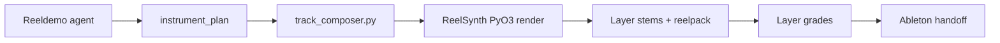

# Reeldemo Studio integration

ReelSynth is the **MIT open-source wavetable engine**. [Reeldemo Studio](https://github.com/reeldemo/reeldemo-ableton) is the **commercial agent layer** that composes, renders, and hands off editable sessions to Ableton Live.

You do not need Reeldemo Studio to use ReelSynth standalone. This doc is for users who want the full agent → DAW pipeline.

## OSS vs commercial

| Component | Repo | License |
|-----------|------|---------|
| DSP engine, `.reelwt` / `.reelpreset`, importers, export CLI | `reelsynth` | MIT |
| Python wrapper, factory tables, import CLI | `reeldemo-ableton` | Commercial |
| Agent compose, text-to-wavetable, session handoff | `reeldemo-ableton` | Commercial |

## Architecture



**AI never renders audio directly.** WAVs come from `engine/track_composer.py` + ReelSynth offline rendering.

## Using ReelSynth in recipes

Set `engine: "reelsynth"` on programmatic delivery recipes:

```json
{
  "layer": "melody",
  "delivery": "programmatic",
  "engine": "reelsynth",
  "wavetable_id": "bright_lead",
  "oscillators": [{"type": "wavetable", "position": 32, "unison": 3}],
  "filter": {"type": "lowpass", "cutoff": 1800}
}
```

Factory wavetables live in `reeldemo-ableton/data/wavetables/` (`saw_morph`, `formant`, `bright_lead`, …).

Build the native module:

```bash
cd ../reelsynth
PYO3_USE_ABI3_FORWARD_COMPATIBILITY=1 maturin develop --features python
```

## Compose contract

The agent must return distinct layer plans. **Melody must use `synthesis: lead`** — not the same prompt as chords.

```json
{
  "bpm": 128,
  "key": "A",
  "mode": "phrygian",
  "instrument_plan": [
    {"layer": "drums", "delivery": "kit", "handover_mode": "midi_drum_rack"},
    {"layer": "bass", "delivery": "programmatic", "synthesis": "bass", "engine": "reelsynth"},
    {"layer": "chords", "delivery": "programmatic", "synthesis": "chord", "engine": "reelsynth"},
    {"layer": "melody", "delivery": "programmatic", "synthesis": "lead", "engine": "reelsynth"},
    {"layer": "fx", "delivery": "programmatic", "synthesis": "fx_hit"}
  ]
}
```

## Agent workflow loop

```
compose → compose_view → evolve → layer_grades → handover_plan → handover
```

1. **Compose** — stems + `instrument_plan`
2. **Design layers** — batch-render agent instrument choices
3. **Grade** — isolated traces (not the full master mix)
4. **Handover** — push winning layers to Ableton

## Ableton handoff

### Extension import (Live 12)

From `reeldemo-ableton/extensions/reeldemo-handover/`:

1. Python writes `session_handover.json` + WAVs to `~/Music/Ableton/Reeldemo/inbox/<bundle_id>/`
2. Live menu: **Import Reeldemo session**
3. Creates tracks, loads devices, writes MIDI + automation

### Handover modes

| Mode | Live receives |
|------|---------------|
| `audio` | WAV clip |
| `midi` | Raw MIDI |
| `midi_device` | MIDI + device param JSON |
| `midi_drum_rack` | Drum Rack + MIDI |

Environment: `REELDEMO_HANDOVER_MODE=osc` (default) or `sdk` for Extension inbox.

## Export from Reeldemo sessions

ReelSynth export logic is OSS; batch session export is commercial.

**CLI (OSS):**

```bash
cargo run --bin reelsynth-export -- reelpack patch.reelpreset -o out/ \
  --targets vital,wav,serum,ableton,sfz,midi,audio
```

**Python (commercial wrapper):**

```python
from engine.reelsynth_export import export_layer, export_session
report = export_layer(recipe, targets=["vital", "reelpack"], out_dir="/tmp/out")
```

**API / MCP (license-gated):**

- `POST /api/v1/synth/export?session_id=…`
- MCP: `reeldemo_export_sound`
- `instrument_plan` field: `export_targets: ["ableton", "vital", "reelpack"]`

Handover bundles may include `synth_exports/` reelpack subtrees when recipes use `engine=reelsynth`.

## Text-to-wavetable (commercial)

- `POST /api/v1/synth/text-to-wavetable?session_id=…`
- MCP: `reeldemo_text_to_wavetable`
- Output: `sessions/{id}/wavetables/{hash}.reelwt`

When GPU is unavailable, a factory formant fallback satisfies the integration contract (not silent saw substitution).

## Further reading (reeldemo-ableton repo)

| Doc | Topic |
|-----|-------|
| `docs/REELSYNTH.md` | Integration details |
| `docs/CURSOR_REMOTE_HANDOVER.md` | Full compose → handoff loop |
| `docs/INSTRUMENT_API.md` | Layer delivery defaults |
| `docs/PRODUCT.md` | Product vision |
| `extensions/reeldemo-handover/README.md` | Live 12 Extension |

## Standalone vs Studio

| Task | Use |
|------|-----|
| Hand-play melody, tweak one lead sound | ReelSynth standalone — [WORKFLOW.md](WORKFLOW.md) Path A |
| Agent composes full track, push to Ableton | Reeldemo Studio — this doc |
| Script offline render in your own tool | [SDK.md](SDK.md) |
