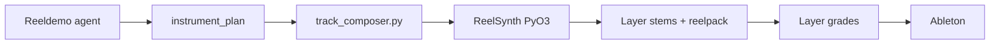

# Reeldemo Studio

ReelSynth is the MIT wavetable engine. [Reeldemo Studio](https://github.com/reeldemo/reeldemo-ableton) is the commercial agent that composes, renders, and hands sessions to Ableton.

You don’t need Studio for the standalone app. This page is for the agent → DAW pipeline.

## Who owns what

| Piece | Repo | License |
|-------|------|---------|
| DSP, formats, importers, export CLI | `reelsynth` | MIT |
| Python wrappers, factory tables used by Studio | `reeldemo-ableton` | Commercial |
| Agent compose, text-to-wavetable, session handoff | `reeldemo-ableton` | Commercial |

## Shape


```mermaid
flowchart LR
  Agent[Reeldemo agent] --> Plan[instrument_plan]
  Plan --> Composer[track_composer.py]
  Composer --> RS[ReelSynth PyO3]
  RS --> Stems[Layer stems + reelpack]
  Stems --> Grade[Layer grades]
  Grade --> Handover[Ableton]
```

Audio comes from `track_composer.py` + ReelSynth offline render — not from the LLM inventing WAV bytes.

## Recipes

Set `engine: "reelsynth"`:

```json
{
  "layer": "melody",
  "delivery": "programmatic",
  "engine": "reelsynth",
  "wavetable_id": "bright_lead",
  "oscillators": [{"type": "wavetable", "position": 32, "unison": 3}],
  "filter": {"type": "lowpass", "cutoff": 1800}
}
```

Factory tables: `reeldemo-ableton/data/wavetables/` (`saw_morph`, `formant`, `bright_lead`, …).

```bash
cd ../reelsynth
PYO3_USE_ABI3_FORWARD_COMPATIBILITY=1 maturin develop --features python
```

## Compose contract

Layers must be distinct. Melody uses `synthesis: lead` — not the chord prompt.

```json
{
  "bpm": 128,
  "key": "A",
  "mode": "phrygian",
  "instrument_plan": [
    {"layer": "drums", "delivery": "kit", "handover_mode": "midi_drum_rack"},
    {"layer": "bass", "delivery": "programmatic", "synthesis": "bass", "engine": "reelsynth"},
    {"layer": "chords", "delivery": "programmatic", "synthesis": "chord", "engine": "reelsynth"},
    {"layer": "melody", "delivery": "programmatic", "synthesis": "lead", "engine": "reelsynth"},
    {"layer": "fx", "delivery": "programmatic", "synthesis": "fx_hit"}
  ]
}
```

## Loop

```
compose → compose_view → evolve → layer_grades → handover_plan → handover
```

1. Compose — stems + plan  
2. Design layers — batch render  
3. Grade — isolated traces (not the master mix)  
4. Handover — push winners to Ableton  

## Ableton handoff

### Standalone Send (OSS)

Header **Ableton** writes under `~/…/Ableton/User Library/ReelSynth/inbox/<patch>_<ts>/` (`reelsynth-ableton-wt-v2` + `table_multicycle.wav`). AbletonOSC can create a Wavetable track and apply params. Custom tables still need **one drag** onto the sprite.

### Live 12 Extension

From `reeldemo-ableton/extensions/reeldemo-handover/`:

1. Python drops `session_handover.json` + WAVs in `~/Music/Ableton/Reeldemo/inbox/<bundle_id>/`
2. Live menu: **Import Reeldemo session**
3. Tracks, devices, MIDI, automation land

### Modes

| Mode | Live gets |
|------|-----------|
| `audio` | WAV clip |
| `midi` | Raw MIDI |
| `midi_device` | MIDI + device param JSON |
| `midi_drum_rack` | Drum Rack + MIDI |

`REELDEMO_HANDOVER_MODE=osc` (default) or `sdk` for Extension inbox.

## Export from Studio sessions

Export code is OSS; batch session export is commercial.

**CLI:**

```bash
cargo run --bin reelsynth-export -- reelpack patch.reelpreset -o out/ \
  --targets vital,wav,serum,ableton,sfz,midi,audio
```

**Python (commercial wrapper):**

```python
from engine.reelsynth_export import export_layer, export_session
report = export_layer(recipe, targets=["vital", "reelpack"], out_dir="/tmp/out")
```

**API / MCP (license-gated):** `POST /api/v1/synth/export`, MCP `reeldemo_export_sound`, `export_targets` on `instrument_plan`.

Handover bundles may include `synth_exports/` when recipes use `engine=reelsynth`.

## Text-to-wavetable (commercial)

- `POST /api/v1/synth/text-to-wavetable`
- MCP: `reeldemo_text_to_wavetable`
- Writes `sessions/{id}/wavetables/{hash}.reelwt`

No GPU → factory formant fallback (not a silent saw swap).

## More in reeldemo-ableton

| Doc | Topic |
|-----|-------|
| `docs/REELSYNTH.md` | Integration |
| `docs/CURSOR_REMOTE_HANDOVER.md` | Compose → handoff |
| `docs/INSTRUMENT_API.md` | Layer defaults |
| `docs/PRODUCT.md` | Product notes |
| `extensions/reeldemo-handover/README.md` | Live 12 Extension |

## When to use what

| Task | Use |
|------|-----|
| Hand-play one lead | Standalone — [WORKFLOW.md](WORKFLOW.md) Path A |
| Agent track → Ableton | Studio — this doc |
| Your own offline tools | [SDK.md](SDK.md) |
