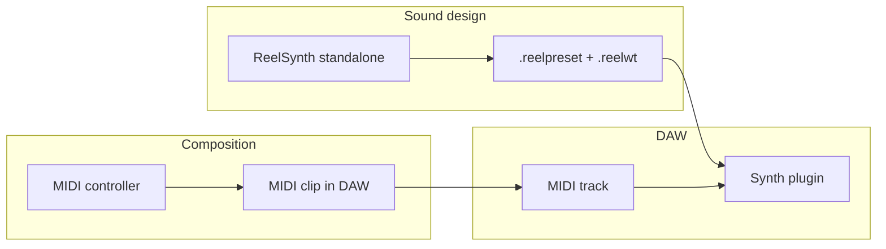

# DAW workflow — melody + sound handoff

This guide explains how to compose a melody, design the sound in ReelSynth, and get **both** into a DAW for arrangement and mixing.

## The two things you need

| Asset | What it is | Where it lives |
|-------|------------|----------------|
| **Performance** | Notes, timing, velocity | MIDI clip in your DAW |
| **Sound** | Wavetable + patch settings | `.reelpreset` + `.reelwt`, or export to Vital / Wavetable |

Keep them separate. Change the melody without re-tweaking the synth, or swap sounds without re-playing.



---

## Path A — Manual (standalone + any DAW)

### Step 1 — Launch and connect MIDI

```bash
cargo run -p reelsynth-app --bin reelsynth-app
```

1. Select your MIDI device in the header dropdown.
2. Play notes to audition the default patch.
3. See [GETTING_STARTED.md](GETTING_STARTED.md) for QWERTY and piano input.

### Step 2 — Design and save the sound

Tweak while playing:

- Oscillators, filter, ADSR, LFO, mod matrix, FX
- **Save** → `my_lead.reelpreset`
- **WT → Save .reelwt** if you edited the table

See [UI.md](UI.md) for every control.

### Step 3 — Export a DAW-ready bundle

```bash
cargo run --bin reelsynth-export -- reelpack my_lead.reelpreset -o out/ \
  --targets vital,wav,serum,ableton,sfz,midi,audio
```

Output layout:

```
out/my_lead.reelpack/
  canonical/patch.reelpreset
  canonical/table.reelwt
  synth/vital/table.vitaltable
  synth/wav_frames/frame_000.wav …
  synth/ableton/wavetable_map.json
  synth/serum/patch_export.fxp
  daw/midi/melody.mid          ← single demo note, NOT your performance
  daw/audio/melody.wav         ← single-note preview stem
  export_report.json           ← what was lost in export
```

Read [INTEROP.md](INTEROP.md) before expecting 1:1 sound in Vital or Ableton — mod matrix and FX may not transfer.

### Step 4 — Record melody in the DAW

**ReelSynth cannot record your live performance yet.** Record MIDI in the DAW:

1. Create a MIDI track.
2. Arm record, select any placeholder instrument.
3. Play your melody on the MIDI controller.
4. Edit in the piano roll — fix notes, quantize, adjust velocity.

This is standard professional workflow.

### Step 5 — Load your ReelSynth sound on that track

**Vital (free, any DAW with VST):**

1. Load Vital on the MIDI track.
2. Import `synth/vital/table.vitaltable`.
3. Match filter and ADSR from your preset by ear (or read `.reelpreset` JSON).

**Ableton Wavetable:**

1. Load wav frames from `synth/wav_frames/` into Wavetable.
2. Use `synth/ableton/wavetable_map.json` as a param reference.

**Audio-only (least flexible):**

1. Bounce MIDI through Vital/Wavetable to a WAV clip.
2. Do not use `daw/audio/melody.wav` as your melody — it is one reference note.

### Step 6 — Arrange and mix

- Duplicate clips, layer harmonies, automate filter cutoff.
- Freeze/flatten to audio when the sound is final.

More free-tool options: [FREE_STACK.md](FREE_STACK.md).

---

## Path B — Reeldemo Studio (automated)

If you use **[Reeldemo Studio](https://github.com/reeldemo/reeldemo-ableton)** (commercial), the agent composes layers and hands off MIDI + audio to Ableton without manual MIDI recording.

Full detail: [REELDEMO_INTEGRATION.md](REELDEMO_INTEGRATION.md).

Summary:

1. **Compose** — agent returns BPM, key, mode, `instrument_plan[]` (`melody` → `synthesis: lead`).
2. **Render** — ReelSynth engine (`engine: "reelsynth"`) generates stems offline.
3. **Grade** — listen to isolated layer traces.
4. **Hand off** — push to Ableton (OSC or Live 12 Extension).

| `handover_mode` | What lands in Live |
|-----------------|-------------------|
| `audio` | WAV clip |
| `midi` | Raw MIDI clip |
| `midi_device` | MIDI + Wavetable param JSON |
| `midi_drum_rack` | Drums → Drum Rack |

---

## Capability matrix (honest)

| Capability | Today | Future |
|------------|-------|--------|
| Live MIDI play in standalone | Yes | — |
| Save/load patch + wavetable | Yes | — |
| Export `reelpack` | Yes | Richer round-trips |
| Record performance to MIDI in app | **No** | Planned |
| Load as DAW plugin | **No** | S7 CLAP/VST3/AU |
| Export your melody as MIDI | **No** | With MIDI recording |

---

## Common mistakes

1. Expecting in-app MIDI recording — use the DAW.
2. Treating `daw/midi/melody.mid` as your performance — it is a pipeline demo note.
3. Exporting to Serum/Ableton and expecting identical sound — check `export_report.json`.
4. Saving only `.reelpreset` without the sibling `.reelwt`.
5. Waiting for a plugin instead of using Vital + export today.

---

## Quick reference

**Sound design:** ReelSynth standalone → Save preset + WT  
**Melody:** DAW MIDI track (Path A) or Reeldemo compose (Path B)  
**Sound in DAW:** `reelpack` → Vital / Wavetable / SFZ  
**Canonical state:** `canonical/patch.reelpreset` + `canonical/table.reelwt`
