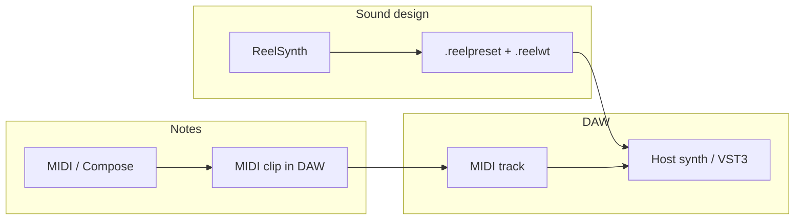

# DAW workflow

Design the sound in ReelSynth, get notes into a DAW, load the sound on that track. Compose mode sketches clips in-app; a DAW still wins for full arrange/mix/collab.

## Two pieces

| Asset | What | Where |
|-------|------|-------|
| Performance | Notes, timing, velocity | Compose clips *or* a MIDI clip in the DAW |
| Sound | Wavetable + patch | `.reelpreset` + `.reelwt`, or export → Vital / Wavetable |

Keep them separate so you can swap melody or sound without rebuilding both.


```mermaid
flowchart LR
  subgraph design [Sound design]
    RS[ReelSynth]
    Preset[".reelpreset + .reelwt"]
    RS --> Preset
  end

  subgraph compose [Notes]
    MIDIctrl[MIDI / Compose]
    MIDIf[MIDI clip in DAW]
    MIDIctrl --> MIDIf
  end

  subgraph daw [DAW]
    Track[MIDI track]
    Synth[Host synth / VST3]
    Preset --> Synth
    MIDIf --> Track
    Track --> Synth
  end
```

---

## Path A1 — Compose in ReelSynth

1. Toggle **Compose** in the header.
2. Design the sound in Design mode, then come back to Compose.
3. Double-click the arrangement for clips; draw notes in the piano roll.
4. Arm (**R**), record **●**, play via the 88-key strip, QWERTY, or MIDI.
5. Scenes for clip launch; arrangement playhead for linear playback.
6. Save `.reelpreset` — sequence embedding in the patch schema is in progress.
7. Optional reelpack when full SMF export lands.

---

## Path A — Standalone + any DAW

### 1. Launch and MIDI

```bash
cargo run -p reelsynth-app --bin reelsynth-app
```

Pick MIDI in the header, audition the default patch. QWERTY / piano: [GETTING_STARTED.md](GETTING_STARTED.md).

### 2. Design and save

Tweak oscs, filter, ADSR, LFO, mod matrix, FX. Wrap ticks after import/Quant → header **ReelAI** or Selected **Fit ends** ([GETTING_STARTED.md](GETTING_STARTED.md#clean-wrap-crackle-with-reelai)).

- **Save** → `my_lead.reelpreset`
- **WT → Save .reelwt** if you edited the table (keeps a seam bake you want)

### 3. Export

```bash
cargo run --bin reelsynth-export -- reelpack my_lead.reelpreset -o out/ \
  --targets vital,wav,serum,ableton,sfz,midi,audio
```

```
out/my_lead.reelpack/
  canonical/patch.reelpreset
  canonical/table.reelwt
  synth/vital/table.vitaltable
  synth/wav_frames/frame_000.wav …
  synth/ableton/wavetable_map.json
  synth/serum/patch_export.fxp
  daw/midi/melody.mid          ← demo note, not your performance
  daw/audio/melody.wav         ← single-note preview
  export_report.json           ← what was dropped
```

Read [INTEROP.md](INTEROP.md) before expecting identical sound in Vital or Ableton.

### 4. Record melody in the DAW

Export MIDI is not your live take. In the DAW:

1. New MIDI track, arm, any placeholder instrument.
2. Record the melody.
3. Edit in the piano roll.

### 5. Put the sound on that track

**Vital (free):**

1. Vital on the MIDI track.
2. Import `synth/vital/table.vitaltable`.
3. Match filter/ADSR by ear (or read the JSON preset).

**Ableton — Send or export:**

1. Header **Ableton**, or reelpack with `ableton` in `--targets`.
2. Drag `synth/ableton/table_multicycle.wav` onto the Wavetable sprite (inbox opens when it can).
3. With AbletonOSC up, Send may create a MIDI track and apply mapped params (`reelsynth-ableton-wt-v2`).
4. Frames still need that one drag (Live API). For play-in-Live without the bridge, use the VST3 — [ABLETON.md](ABLETON.md).

**Ableton — manual:**

1. Load `synth/wav_frames/` or the multicycle WAV into Wavetable.
2. Use `wavetable_map.json` as a param cheat sheet.

**Audio only:** bounce MIDI through Vital/Wavetable. Don’t treat `daw/audio/melody.wav` as the song — it’s one reference note.

### 6. Arrange

Duplicate clips, layer, automate. Freeze when the sound is done. Free-tool options: [FREE_STACK.md](FREE_STACK.md).

---

## Path B — Reeldemo Studio

Commercial agent composes layers and pushes MIDI/audio to Ableton. Details: [REELDEMO_INTEGRATION.md](REELDEMO_INTEGRATION.md).

Short version: compose → render with `engine: "reelsynth"` → grade layers → hand off (`audio` / `midi` / `midi_device` / `midi_drum_rack`).

---

## Status

| Thing | Today |
|-------|--------|
| Live MIDI in standalone | Yes |
| Save/load patch + table | Yes |
| Export `reelpack` | Yes (lossy to foreign formats) |
| Compose clips + record in-app | Yes |
| Export Compose song as SMF | Not yet |
| DAW plugin | VST3 preview (Win/macOS Ableton); polish ongoing |
| `daw/midi/melody.mid` | Demo note only |

Ableton install + VST3: [ABLETON.md](ABLETON.md).

---

## Easy mistakes

1. Treating `daw/midi/melody.mid` as your performance.
2. Expecting Serum/Ableton export to sound identical — check `export_report.json`.
3. Saving `.reelpreset` without the sibling `.reelwt`.
4. Waiting on a plugin when Vital + export already works.

---

## Cheat sheet

- **Sound:** standalone → Save preset + WT  
- **Notes:** Compose or DAW MIDI (Path A), Studio compose (Path B)  
- **In DAW:** `reelpack` → Vital / Wavetable / SFZ, or Live VST3  
- **Source of truth:** `canonical/patch.reelpreset` + `canonical/table.reelwt`
