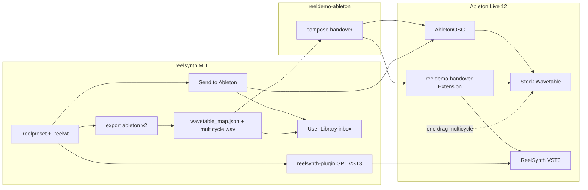

# Spec: Ableton Live Integration

Technical architecture / how-to-build. Visual UI mockups (if any) belong in a separate `design.md` — **not** this file.

**Status:** SPEC LOCKED (done) — 2026-07-26. Grill ×3 + closure pass.  
**Requirements:** [requirements.md](requirements.md)  
**Constitution:** [../../CONSTITUTION.md](../../CONSTITUTION.md)  
**Tasks:** [tasks.md](tasks.md)

## Approach (locked)

Ship in three product layers on one shared export contract:

1. **Contract + bridge** (OSS): `reelsynth-ableton-wt-v2` + multi-cycle WAV + in-app **Send to Ableton** via AbletonOSC when available.
2. **Studio handoff** (`reeldemo-ableton`): consume the same map; implement Extension import; keep OSC as default until Extension is verified.
3. **VST3 instrument** (OSS `plugin/`, GPL-3.0): real Live integration; Wavetable bridge becomes fallback.

**Why:** Live cannot programmatically load custom Wavetable sprites; VST3 is the only seamless Ableton path. Bridge remains valuable for Lite / no-plugin installs and for agents that still target stock Wavetable.

## Architecture



### Components

| Component | Repo | Responsibility |
|-----------|------|----------------|
| `export_ableton_map` v2 | reelsynth | Schema + aliases + frame paths |
| `export_ableton_multicycle_wav` | reelsynth | Concatenate bank frames → one mono PCM WAV |
| `send_to_ableton` | reelsynth `app/src/send_ableton.rs` | Inbox write; OSC push when probe succeeds |
| AbletonOSC client (thin) | reelsynth `app/src/ableton_osc.rs` | Probe :11000; create track; insert Wavetable; set params |
| Param alias apply | reeldemo-ableton | When `reelsynth` layer + map present, apply map params (aliases) instead of recipe defaults |
| Extension import | reeldemo-ableton | Real `importHandoverBundle` for `midi_device` (+ later VST3 mode) |
| `SynthEngine` plugin | reelsynth `plugin/` | nih-plug VST3(+CLAP); egui editor; state blob |

## Schema: `reelsynth-ableton-wt-v2`

```json
{
  "schema": "reelsynth-ableton-wt-v2",
  "device": "ableton:wavetable",
  "contract_id": "ableton:wavetable",
  "patch_name": "string",
  "parameters": {
    "osc1_pos": 0.0,
    "filter_freq": 0.0,
    "filter_res": 0.0,
    "amp_attack": 0.0,
    "amp_release": 0.0
  },
  "live_param_aliases": {
    "osc1_pos": ["Osc 1 Position", "osc1_pos"],
    "filter_freq": ["Filter Freq", "filter_cutoff", "filter_freq"],
    "filter_res": ["Filter Res", "filter_resonance", "filter_res"],
    "amp_attack": ["Amp Attack", "amp_attack"],
    "amp_release": ["Amp Release", "amp_release"]
  },
  "frames": {
    "dir": "synth/wav_frames/",
    "multi_cycle_wav": "synth/ableton/table_multicycle.wav",
    "frame_count": 256,
    "samples_per_frame": 2048
  },
  "macro_hints": [],
  "notes": "Custom sprite requires one user drag of multi_cycle_wav onto Wavetable; params may be applied via OSC/Extension."
}
```

Normalization rules unchanged from v1 (`ableton.rs`): log cutoff 20–20k; attack `/5`; release `/8`; position ≤1 or `/255`.

**Compat:** Keep emitting semantic keys Studio already understands; add aliases so OSC `_apply_device_params` accepts both OSS and legacy recipe keys. Bump schema string; readers that only check `reelsynth-ableton-wt-v1` must be updated (Studio + OSS tests).

## Inbox paths (OQ-1 resolved)

| Platform | Default inbox root |
|----------|-------------------|
| Windows | `%USERPROFILE%\Documents\Ableton\User Library\ReelSynth\inbox\` |
| macOS | `~/Music/Ableton/User Library/ReelSynth/inbox/` |
| Override | Env `REELSYNTH_ABLETON_INBOX` = absolute directory (Send writes `<root>/<patch_slug>_<utc>/`) |

Bundle layout under each send folder:

```
canonical/patch.reelpreset
canonical/table.reelwt
synth/ableton/wavetable_map.json
synth/ableton/table_multicycle.wav
synth/wav_frames/frame_*.wav   # always written by Send (full set); multicycle is the primary drag target
README.txt
```

## AbletonOSC probe + push (Phase 1)

Locked client: `app/src/ableton_osc.rs` (UDP only; no Python; no Studio dependency).

| Step | OSC / action |
|------|----------------|
| Probe | Send `/live/song/get/tempo` to `127.0.0.1:11000`; wait ≤500ms for any reply → online |
| Create track | `/live/song/create_midi_track` with index `-1` (append) |
| Insert device | `/live/track/insert_device` track index + name `Wavetable` (Luftbahn AbletonOSC fork; class `InstrumentVector`) |
| List params | `/live/device/get/parameters/name` on inserted device |
| Set params | `/live/device/set/parameter/value` for each matched alias → normalized 0–1 value |
| Open folder | OS shell open of inbox path (not OSC) |

- **Offline:** write inbox + status string naming AbletonOSC install; export still `Ok`.
- Unmatched params: append names to status; do not abort track creation.

## Live version (OQ-2 resolved)

| Path | Requirement |
|------|-------------|
| Send + OSC | Live 12.x + AbletonOSC control surface |
| Extension import | Live 12 Suite **12.4.5+** with Extensions (Studio docs); OSC remains default until Extension verified |
| VST3 | Live 10.1+ theoretically; QA target **Live 12** |

## Multi-cycle WAV

Public API (locked):

```rust
// src/export/ableton.rs (or ableton_wav.rs re-exported from export::)
pub fn export_ableton_multicycle_wav(
    bank: &WavetableBank,
    out_path: &Path,
) -> ExportReport;

pub fn export_ableton_map_v2(
    preset: &Patch,
    bank: &WavetableBank,
    out_path: &Path,
) -> ExportReport; // writes JSON including frames.* derived from bank
```

- Source: `WavetableBank` frames in order, mono f32 → 16-bit PCM LE @ 44100 via existing `write_wav_mono` helpers where practical.
- Body = concat of all frames; `frame_count` / `samples_per_frame` taken from bank metadata.
- Tests: `frames.frame_count == bank.frame_count()`; file exists; PCM payload length == `frame_count * samples_per_frame * 2`.

## Plugin (US-4) — nih-plug

### Licensing

- Change [`plugin/Cargo.toml`](../../../../plugin/Cargo.toml) `license` to `GPL-3.0-or-later` (or dual `MIT OR GPL-3.0-or-later` only if CLAP-only build is separable — **locked for MVP:** whole `reelsynth-plugin` package **GPL-3.0-or-later** once VST3 is linked).
- Root/`reelsynth` crate stays MIT. README + CHANGELOG call out the wall.

### Processor

- `Plugin` holds `SynthEngine` behind RT-safe state.
- Audio: stereo out via `process_stereo`.
- MIDI: note on/off, sustain CC, pitch bend minimum.
- SR change: re-init engine at new rate on `initialize` / reset.

### Params (v1 automatable subset — required, not optional)

| Param id | Maps to |
|----------|---------|
| `wt_position` | osc0 position (0–1) |
| `filter_cutoff` | filter cutoff Hz |
| `filter_res` | resonance |
| `amp_attack` | envelope attack |
| `amp_release` | envelope release |

Macros are **not** in v1 host params (edit via egui / patch only). Full patch still edits via egui.

### State

Locked format: JSON UTF-8 inside nih-plug plugin state:

```json
{ "schema": "reelsynth-plugin-state-v1", "preset": { /* Patch */ }, "reelwt_b64": "<base64 .reelwt bytes>" }
```

Restore on set load (AC-4.5). Reject unknown `schema` with default patch + empty bank warning in editor status.

### Editor

- `nih_plug_egui` + shared `draw_shell`.
- Add `HostSurface { mode: Plugin }` (name locked) passed into shell: hide MIDI/Audio device dropdowns; status “Hosted by DAW”; **Compose UI hidden** in v1 (AC-4.8).
- Retire null `clap_entry()` stub; use `nih_export_vst3!` + `nih_export_clap!`.

### Packaging

- `nih_plug_xtask` bundle → `.vst3` (Win/macOS).
- Install docs: Common Files VST3 / Library Audio Plug-Ins VST3; Live rescan.

## Studio (US-3) — parallel repo work

Locked behaviors (implement in `reeldemo-ableton` when cloned):

1. `_apply_device_params`: merge `live_param_aliases` + semantic keys; when `handover_plan.layers[].reelsynth.ableton_map` is present, apply that map and ignore conflicting recipe defaults for the five mapped keys.
2. Stage `table_multicycle.wav` into inbox next to stems.
3. Extension: replace stub `importHandoverBundle` with track create + device + MIDI + params for `midi_device`; surface errors in Live UI/console.
4. Add handover mode `midi_reelsynth_vst3` after plugin ships (browser load / insert plugin by name); fallback Wavetable if missing.
5. Keep `REELDEMO_HANDOVER_MODE=osc` default until Extension QA passes.

## File touch list (reelsynth)

| Path | Change |
|------|--------|
| `src/export/ableton.rs` | v2 schema, aliases, frames block |
| `src/export/ableton.rs` (+ helpers) | multi-cycle writer + `export_ableton_map_v2` |
| `src/export/reelpack.rs` | include multicycle path |
| `src/export/mod.rs` | dispatch / public API |
| `tests/qa/integration.rs` | schema + multicycle asserts |
| `app/src/ableton_osc.rs`, `app/src/send_ableton.rs`, `app/src/app.rs` | OSC + Send + status |
| `ui/src/shell/` | **Send to Ableton** control in header/menu |
| `plugin/*` | nih-plug rewrite, LICENSE GPL |
| `docs/INTEROP.md`, `WORKFLOW.md`, `REELDEMO_INTEGRATION.md`, `CHANGELOG.md` | honesty + paths |
| `docs/sdd/CONSTITUTION.md` | already accepted |

## Risks & honesty

| Risk | Mitigation |
|------|------------|
| Users expect one-click custom WT timbre via bridge | README + toast + constitution; VST3 is the real fix |
| GPL plugin surprises MIT users | Loud docs; separate crate license |
| egui-in-host DPI/parenting bugs on Windows Live | Smoke matrix; fall back to smaller editor if needed |
| AbletonOSC fork divergence | Document exact script; probe-based graceful degrade |
| Extension API incomplete | OSC default; Extension behind feature flag |
| Param name mismatch across Live locales/versions | Alias list + fuzzy match on get-parameters; report unset params in status |

## Public app API (Send)

```rust
// app/src/send_ableton.rs
pub struct SendAbletonResult {
    pub inbox_dir: PathBuf,
    pub osc_online: bool,
    pub status: String, // user-visible; never claims frames auto-loaded
}

pub fn send_to_ableton(
    preset: &Patch,
    bank: &WavetableBank,
    inbox_override: Option<&Path>, // else REELSYNTH_ABLETON_INBOX / platform default
) -> Result<SendAbletonResult, String>;
```

## AC → spec mapping (per AC)

| AC | Spec element |
|----|----------------|
| AC-1.1 | Schema string `reelsynth-ableton-wt-v2` |
| AC-1.2 | `parameters` object (5 keys) |
| AC-1.3 | `live_param_aliases` |
| AC-1.4 | `export_ableton_multicycle_wav` + `frames.multi_cycle_wav` |
| AC-1.5 | existing dropped-param path in `export_ableton_map_v2` |
| AC-1.6 | `tests/qa/integration.rs` asserts |
| AC-2.1 | UI Send + `send_to_ableton` |
| AC-2.2 | Inbox layout + README.txt |
| AC-2.3 | AbletonOSC table (online actions) |
| AC-2.4 | Offline branch + status |
| AC-2.5 | `SendAbletonResult.status` contract |
| AC-2.6 | Inbox write before OSC |
| AC-3.1–3.5 | Studio section |
| AC-4.1 | nih-plug VST3 bundle |
| AC-4.2 | Processor MIDI/audio/SR |
| AC-4.3 | `HostSurface { mode: Plugin }` + egui embed |
| AC-4.4 | Params table (5 ids) |
| AC-4.5 | `reelsynth-plugin-state-v1` JSON |
| AC-4.6 | GPL-3.0-or-later on `reelsynth-plugin` |
| AC-4.7 | CLAP export + docs non-claim for Live |
| AC-4.8 | Compose hidden in plugin v1 |
| AC-5.1–5.4 | Docs touch list + CHANGELOG |

## Spec done criteria (exit)

Spec is **done** when all of the following hold (closure pass verified):

1. Approach locked; no A/B option menus left in normative sections.
2. Every AC has a row in the per-AC mapping table.
3. Public function names and OSC addresses are specified.
4. OQ-1 / OQ-2 resolved; plugin state + param subset locked.
5. Grill-me plan loop ≥3 passes documented.
6. [tasks.md](tasks.md) exists and references this spec.

**Closure pass (loop):** Soft “or/prefer/optional” removed from normative API/OSC/state/param sections; per-AC map expanded; Done criteria added. Spec marked **SPEC LOCKED**.

## Grill-me plan loop log

Calibration (user waived interactive gates: “iterate until done”): Knowledge **Working**, Pressure **Standard**. Self-grill against research + codebase; no blocking user Qs.

### Pass 1 — Ambiguities

- Locked inbox env `REELSYNTH_ABLETON_INBOX` and OS defaults (was OQ-1).
- Locked Live version matrix (was OQ-2).
- Locked MIT Send uses **Rust OSC client**, not Studio Python.
- Confirmed schema bump to **v2** with aliases rather than renaming-only breaking keys.

### Pass 2 — Tradeoffs & execution

- Rejected M4L-as-primary (out of scope); optional later only.
- Rejected CLAP-first for Ableton (Live unsupported).
- Parallelism: export v2 + plugin scaffolding can start together; Send depends on v2; Studio depends on v2; Extension after OSC path proven.
- Plugin package entirely GPL once VST3 linked (simpler than dual-build matrix for MVP).

### Pass 3 — Failure modes, validation, reversibility

- Offline OSC: inbox still written (AC-2.4).
- Param apply failure: status lists unmatched names; track still created.
- Rollback: v1 map readers — document migration; keep writing semantic keys.
- Validation: unit/integration tests for export; manual Live checklist for Send + VST3; Studio handover smoke when repo available.
- Reversibility: feature-flag Send in UI if needed; plugin uninstall = remove `.vst3`; schema v2 additive aliases.

**Early-stop note:** Interactive grill questions skipped per user instruction to iterate until SDD artifacts done; three documented self-passes completed.
