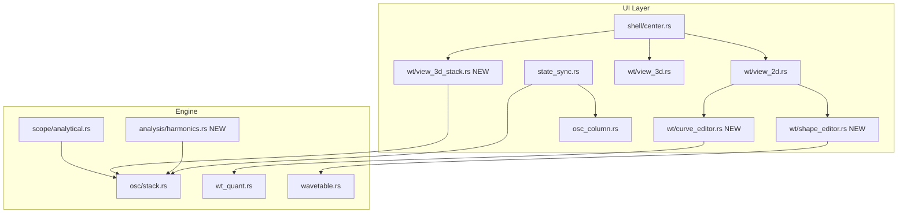

# Wavetable Stack Editor — Implementation Plan

**Repo:** `[github/reeldemo/reelsynth](C:\Users\Julian\Documents\Programming\github\reeldemo\reelsynth)`  
**Spec:** `[docs/superpowers/specs/2026-07-15-wt-stack-editor-design.md](C:\Users\Julian\Documents\Programming\github\reeldemo\reelsynth\docs\superpowers\specs\2026-07-15-wt-stack-editor-design.md)`

## Architecture

## Delivery model (grill session locked)

- **Done means all four phases** — not shippable until stack UI, curve, shape, and FFT all land.
- **Big-bang release** — no public partial release; develop incrementally internally but gate release on full acceptance checklist below.
- **FFT requires phase** — not magnitude-only; add `phase: f32` (radians, default 0) to `WaveLayer` in [`src/patch/schema.rs`](C:\Users\Julian\Documents\Programming\github\reeldemo\reelsynth\src\patch\schema.rs); apply in [`src/osc/stack.rs`](C:\Users\Julian\Documents\Programming\github\reeldemo\reelsynth\src\osc\stack.rs) `sample_layer()` for sine layers.

---

## Critical bug to fix first

`[ui/src/state_sync.rs](C:\Users\Julian\Documents\Programming\github\reeldemo\reelsynth\ui\src\state_sync.rs)` line 77: `osc_ui_to_patch()` spreads `..Oscillator::default_va()` **after** setting fields, wiping `wave_layers` and `stack_mode`. Factory Lead's stack is lost on any UI save.

---

## Phase 1 — Stack roundtrip + layer UI + 3D Stack view

**Goal:** Open Factory Lead, see/edit its 3-layer stack, 3D Stack tab renders layers, save/load preserves stack.

### 1.1 Extend UI model

- `[ui/src/oscillator_ui.rs](C:\Users\Julian\Documents\Programming\github\reeldemo\reelsynth\ui\src\oscillator_ui.rs)`: add `WaveLayerUi`, `wave_layers: Vec<WaveLayerUi>`, `stack_mode: String`
- `[ui/src/state.rs](C:\Users\Julian\Documents\Programming\github\reeldemo\reelsynth\ui\src\state.rs)`: add `wt_view_3d_mode: WtView3dMode` (Stack | Morph)

### 1.2 Fix sync roundtrip

- `[ui/src/state_sync.rs](C:\Users\Julian\Documents\Programming\github\reeldemo\reelsynth\ui\src\state_sync.rs)`:
  - `OscillatorUi::from_patch()` — map `WaveLayer` → `WaveLayerUi`
  - `osc_ui_to_patch()` — explicitly set `wave_layers`, `stack_mode` (remove reliance on default wipe)
- Add unit test: `factory_lead_wave_stack_roundtrip()` (mirror existing `factory_lead_wave_slot_roundtrip`)

### 1.3 Osc column stack panel

- `[ui/src/osc_column.rs](C:\Users\Julian\Documents\Programming\github\reeldemo\reelsynth\ui\src\osc_column.rs)`: collapsible **Stack** section
  - Layer rows: type dropdown (sine/saw/square/tri/wavetable), level, detune, mute, remove
  - Add layer button; stack mode Add/Avg toggle
  - Selecting layer in 3D highlights row

### 1.4 3D Stack renderer

- New `[ui/src/wt/view_3d_stack.rs](C:\Users\Julian\Documents\Programming\github\reeldemo\reelsynth\ui\src\wt\view_3d_stack.rs)`:
  - Input: `&[WaveLayerUi]`, `&WavetableBank`, phase, `stack_mode`
  - Reuse projection math from `[view_3d.rs](C:\Users\Julian\Documents\Programming\github\reeldemo\reelsynth\ui\src\wt\view_3d.rs)` (`MeshLayout`-style depth offset)
  - Per layer: sample via same logic as `[src/osc/stack.rs](C:\Users\Julian\Documents\Programming\github\reeldemo\reelsynth\src\osc\stack.rs)` `sample_layer()` at fixed phase
  - Front plane: composite sum
  - Click hit-test → `selected_layer_idx`

### 1.5 Wire center panel

- `[ui/src/shell/center.rs](C:\Users\Julian\Documents\Programming\github\reeldemo\reelsynth\ui\src\shell\center.rs)`:
  - Segmented control `[ Stack | Morph ]` above 3D panel (default Stack)
  - Pass active osc stack to `WtView3dStack`
  - On stack/layer change → `params_changed` → existing audio sync path

### 1.6 Scope preview parity

- `[src/scope/analytical.rs](C:\Users\Julian\Documents\Programming\github\reeldemo\reelsynth\src\scope\analytical.rs)`: when `uses_wave_stack(osc)`, call `sample_stack()` instead of legacy single-source path

**Phase 1 validation:**

- Load Factory Lead → 3 layers visible in osc column + 3D Stack
- Save/reload preset → stack unchanged
- Scope osc tap matches audible stack thickness

---

## Phase 2 — 2D quant click + Curve editor

**Goal:** Click slots in 2D/strip; drag slot→frame curve at 8–256 quants.

### 2.1 Quant 256 support

- `[src/wt_quant.rs](C:\Users\Julian\Documents\Programming\github\reeldemo\reelsynth\src\wt_quant.rs)`: ensure `generate_even_wave_slots(256, 256)` works; add test
- `[ui/src/osc_column.rs](C:\Users\Julian\Documents\Programming\github\reeldemo\reelsynth\ui\src\osc_column.rs)`: add `"256"` to quant dropdown

### 2.2 Clickable quants in 2D

- `[ui/src/wt/view_2d.rs](C:\Users\Julian\Documents\Programming\github\reeldemo\reelsynth\ui\src\wt\view_2d.rs)`:
  - Pass `wave_quant`, `wave_slot`, `wave_slots` from active osc
  - On click (Select tool): call `[slots.rs](C:\Users\Julian\Documents\Programming\github\reeldemo\reelsynth\ui\src\wt\slots.rs)` `apply_slot_selection()`
  - Draw active-slot vertical band

### 2.3 Curve editor widget

- New `[ui/src/wt/curve_editor.rs](C:\Users\Julian\Documents\Programming\github\reeldemo\reelsynth\ui\src\wt\curve_editor.rs)`:
  - Plot: X = slot index (0..quant-1), Y = frame index (0–255)
  - One draggable handle per slot; at quant=256, full table reorder curve
  - Context: reset handle to linear, smooth segment
  - Writes `wave_slots[i].frame` only (no bank mutation)

### 2.4 Toolbar + tool wiring

- `[ui/src/wt/toolbar.rs](C:\Users\Julian\Documents\Programming\github\reeldemo\reelsynth\ui\src\wt\toolbar.rs)`: add `Curve` to `WtEditTool`, enable it
- `[ui/src/wt/strip.rs](C:\Users\Julian\Documents\Programming\github\reeldemo\reelsynth\ui\src\wt\strip.rs)`: sync selection highlight; mini frame-index bar under cells in Curve mode

**Phase 2 validation:**

- Set quant=64, drag curve handles → modulate position with LFO → hear non-linear scan
- quant=256 → 256 handles render without UI freeze (use viewport culling if needed)

---

## Phase 3 — Shape editor (waveform control points)

**Goal:** Drag up to 256 points on the cycle; writes 2048-sample frame.

### 3.1 Resampling helpers

- `[src/wavetable.rs](C:\Users\Julian\Documents\Programming\github\reeldemo\reelsynth\src\wavetable.rs)`:
  - `downsample_frame_control_points(frame: &[f32; 2048], n: usize) -> Vec<f32>`
  - `upsample_control_points_to_frame(points: &[f32], out: &mut [f32; 2048])` — cubic, wrapped endpoints
- Unit tests: roundtrip sine/saw within tolerance

### 3.2 Shape editor widget

- New `[ui/src/wt/shape_editor.rs](C:\Users\Julian\Documents\Programming\github\reeldemo\reelsynth\ui\src\wt\shape_editor.rs)`:
  - Overlay N handles (slider 8–256, default 256) on 2D waveform plot
  - Drag Y → update control point → upsample → `bank.frame_mut(frame_idx)`
  - Return `frame_edited: true` for existing audio sync in `[app/src/app.rs](C:\Users\Julian\Documents\Programming\github\reeldemo\reelsynth\app\src\app.rs)`

### 3.3 Toolbar

- Add `Shape` to `WtEditTool`; mutually exclusive with Curve/Pencil

**Phase 3 validation:**

- Shape mode: drag points → audible timbre change at current position
- Pencil still works; switching tools doesn't corrupt frame

---

## Phase 4 — Fourier analyze → stack

**Goal:** Analyze current 2048-sample frame → sine `wave_layers` on active osc.

### 4.0 Schema: WaveLayer.phase

- Add `phase: f32` to `WaveLayer` (serde default 0.0, radians at layer phase origin)
- `WaveLayerUi.phase` in UI; roundtrip in `state_sync.rs`
- Engine: sine `sample_layer()` applies `layer.phase` offset: `sin(2π·phase + layer.phase)`

### 4.1 Analysis module

- Add `rustfft` to `[Cargo.toml](C:\Users\Julian\Documents\Programming\github\reeldemo\reelsynth\Cargo.toml)`
- New `[src/analysis/harmonics.rs](C:\Users\Julian\Documents\Programming\github\reeldemo\reelsynth\src/analysis/harmonics.rs)`:
  - `decompose_frame(frame: &[f32; 2048], max_harmonics: usize, min_mag: f32) -> Vec<WaveLayer>`
  - Hann window → real FFT → bins 1..N
  - Map: `source_type="sine"`, `level=normalized magnitude`, `detune=1200*log2(h)` cents, **`phase=atan2(im, re)` per bin**

### 4.2 Tests

- Pure sine → 1 dominant layer with correct phase
- Synthetic saw → descending harmonic levels
- **A/B test:** render original frame vs stack resynthesis; correlation or RMS error below threshold
- Render-after-analyze peak > threshold (`[tests/qa/helpers.rs](C:\Users\Julian\Documents\Programming\github\reeldemo\reelsynth\tests\qa\helpers.rs)` patterns)

### 4.3 UI action

- `[ui/src/wt/toolbar.rs](C:\Users\Julian\Documents\Programming\github\reeldemo\reelsynth\ui\src\wt\toolbar.rs)` or 2D context menu: **Analyze → Stack**
- Dialog: harmonic count (1–32), min magnitude, Replace vs Append
- On confirm: populate active osc `wave_layers`, `stack_mode="add"`, refresh 3D Stack

**Phase 4 validation:**

- Analyze sine frame → ~1 layer; analyze complex WT frame → **A/B sounds close to original**
- 3D Stack shows new sine layers with phase-aware resynthesis

---

## Big-bang acceptance checklist (user-defined)

All must pass before release:

1. **Ear / stack:** Load Factory Lead → 3 layers visible in osc column + 3D Stack; play keys → sounds right; save/reload preserves stack
2. **Curve:** quant=64, drag wild slot curve, LFO on position → obviously non-linear timbre scan
3. **Shape:** drag shape control points → audible timbre change at current frame
4. **FFT A/B:** analyze a frame → stack resynthesis audibly matches original (automated RMS/correlation test in CI)

---

## Performance notes

- **256 curve handles:** render only handles in visible rect; hit-test nearest within radius
- **256 shape points:** same culling; upsample only on drag end (debounce) if frame drops occur
- **FFT:** offline on button press only; 2048-point real FFT is trivial

---

## Docs & commits

- Update `[docs/UI.md](C:\Users\Julian\Documents\Programming\github\reeldemo\reelsynth\docs\UI.md)` after each phase
- Mark spec approved; save plan to `docs/superpowers/plans/2026-07-15-wt-stack-editor.md` on execution
- Conventional commits per phase: `feat(ui): ...`, `feat(analysis): ...`

---

## Out of scope (v1)

- Harmonics spread across Osc 2/3 tabs
- Real-time FFT while playing
- Line/Smooth pencil stubs
- Plugin editor audio I/O

## Risks to watch (grill session)

- **Big-bang latency:** long stretch before any user-visible win — mitigate with internal phase commits + checklist per phase
- **256-handle UI:** curve/shape at max quant may stutter — viewport culling + debounced upsample required
- **Phase on non-sine layers:** only sine layers use `phase`; VA layers ignore it (document in UI)
- **Schema addition:** `WaveLayer.phase` is backward-compatible (serde default 0) but changes preset wire format

